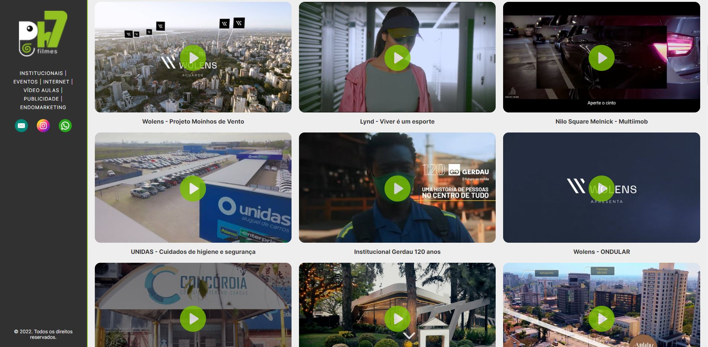

# PH7 Filmes - Site

Projeto desenvolvido como exercício de estudos para a produtora PH7 Filmes.

# Implementações
- Criação da estrutura da página
- Estilização da página
- Showroom com vídeo principal
- Exibição de cards com todos vídeos da produtora no Vimeo
- Visualização dos vídeos em tela cheia
- Botões de contatos
- Botão de alternância entre vídeo principal e demais vídeos
- Responsividade

# Tecnologias utilizadas:
- HTML
- CSS
- JavaScript
- Git/GitHub

[Clique aqui para acessar o projeto](https://axlbr.github.io/ph7filmes/)

# Contato
gabrieltoby@gmail.com
